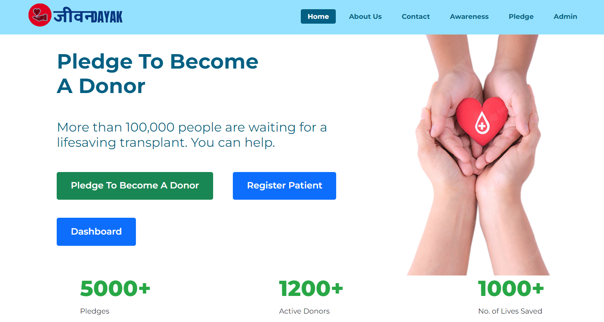

~ An impactful decentralized web platform for organ donation ~

<h2 align="center">Made with ❤ by Team EnigmaX   @ StatusCode1</h2>
<h3 align="center">

[Presentation](https://drive.google.com/file/d/17ZhfLm_lg2pDjNFDDxwOGlWkLIFgkqv_/view?usp=sharing)

[Video Demo](https://youtu.be/bLX4U9JqmRo?si=J2W6bCDv7E_I2d3L) </h3>

# Team Members
- Siddhartha Pal
- Sk Riyaz
- Sayan Bhattacharya
- Roshni Sen
- Saheli Ghosh

## Acknowledgement 🙏
We, team EnigmaX, would like to extend our gratitude to the organizers of StatusCode for providing us with the opportunity to participate in the hackathon and showcase our project, Jeevandayak.   
Special thanks to the developers of solidity, node.js, express.js, ganache, ethereum, html, css and bootstrap for their invaluable contributions to the technologies that powered our project.  
Last but not least, we appreciate the collaborative efforts of our team members who dedicated their time and skills to bring Jeevandayak to fruition during the intense 30-hour hackathon.

## Theme ⚙
Open Innovation (Medical)

## Domain 📡
Web3 Development

## Problem ✒
The current organ and blood donation process suffers from inefficiencies, lack of transparency, and trust, leading to delays, reduced participation, and vulnerability to illegal activities like organ trafficking.

## Solution 🏆
Our project provides a decentralized, transparent platform using blockchain technology to ensure secure and efficient donor-recipient matching. It eliminates middlemen, reducing the risk of illegal activities, and offers a real-time, accessible database for tracking organ availability. Additionally, the platform promotes awareness and trust, encouraging more people to participate in organ and blood donation.

## Introduction to Jeevandayak 💥
Jeevandayak is an innovative platform dedicated to revolutionizing the organ and blood donation process. By leveraging blockchain technology, Jeevandayak ensures secure, transparent, and efficient connections between donors and recipients. The platform not only facilitates the technical aspects of matching and tracking donations but also aims to change societal attitudes towards organ and blood donation, promoting awareness, trust, and increased participation. Through Jeevandayak, we strive to save lives by making the donation process more accessible, reliable, and ethical.

## Technology Stack 👨‍💻
- Solidity
- Blockchain (Web3)
- Node.js
- Express.js
- HTML, CSS, JavaScript
- Version Control (e.g., Git)

## Future Scope
- Partnerships with Local Governments: Collaborate with local health authorities to integrate with and enhance existing organ donation systems.
- Predictive Analytics: Use AI to forecast donation needs and optimize donor-recipient matching based on health data.
Smart Matching Algorithms: Implement machine learning to improve the accuracy and efficiency of donor-recipient matches.
- EHR Integration: Integrate with electronic health records for seamless updates on donor status and communication with healthcare providers.
- Real-time Health Monitoring: Incorporate health monitoring to provide real-time updates on potential donors' health status.

## Conclusion 🔥
Jeevandayak is poised to make a significant impact on the organ and blood donation landscape by addressing key challenges such as inefficiency, lack of transparency, and trust. Through the use of blockchain technology, Jeevandayak offers a secure, decentralized platform that ensures fair and efficient donor-recipient matching while promoting ethical practices and increasing awareness. As we look to the future, Jeevandayak will continue to evolve, expanding its reach and capabilities to save more lives and foster a culture of donation. With Jeevandayak, we are not just connecting donors and recipients; we are building a community dedicated to giving the gift of life.
